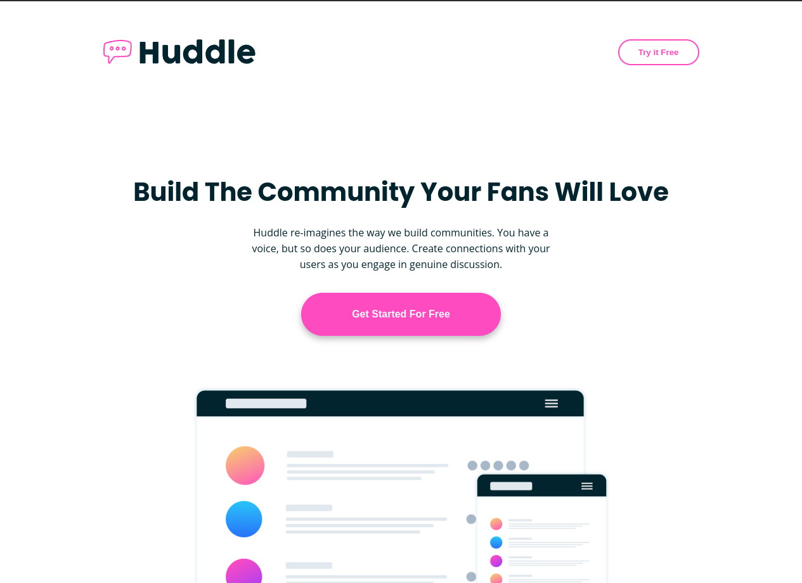

# Frontend Mentor - Huddle landing page with curved sections solution

This is a solution to the [Huddle landing page with curved sections challenge on Frontend Mentor](https://www.frontendmentor.io/challenges/huddle-landing-page-with-curved-sections-5ca5ecd01e82137ec91a50f2). Frontend Mentor challenges help you improve your coding skills by building realistic projects. 

## Table of contents

- [Overview](#overview)
  - [The challenge](#the-challenge)
  - [Screenshot](#screenshot)
  - [Links](#links)
- [My process](#my-process)
  - [Built with](#built-with)
  - [What I learned](#what-i-learned)
- [Author](#author)

**Note: Delete this note and update the table of contents based on what sections you keep.**

## Overview

### The challenge

Users should be able to:

- View the optimal layout for the site depending on their device's screen size
- See hover states for all interactive elements on the page

### Screenshot




### Links

- Solution URL: [solution](https://github.com/thiagoa-martins/huddle-landing-page-with-curved-sections-solution)
- Live Site URL: [github pages](https://thiagoa-martins.github.io/huddle-landing-page-with-curved-sections-solution/)

## My process

### Built with

- Semantic HTML5 markup
- CSS custom properties
- Flexbox
- Desktop first workflow

### What I learned

In this project I was able to develop my box positioning skills, learn new ways to style specific elements more efficiently, practice Flexbox and position elements with position.

```html
 <h1>Some HTML code I'm proud of</h1>

 <header class="header" id="about">
      <div class="container">
        <div class="head">
          <h1>
            <a href="#footer"></a> 
          </h1>
    
          <button>Try it Free</button>
        </div> 
      </div>
    </header>
```
```css
.proud-of-this-css {
  color: papayawhip;
}

.header {
    padding: 60px 0 180px;
}

.header .head {
    display: flex;
    justify-content: space-between;
}

.header .head button {
    border: 2px solid var(--color-primary-pink);
    color: var(--color-primary-pink);
    background-color: var(--color-neutral-very-dark-blue);
    border-radius: 40px;
    padding: 0 30px;
    font-weight: bold;
    cursor: pointer;
}

.header .head button:hover {
    border: 2px solid var(--color-primary-light-pink);
    color: var(--color-primary-light-pink);
    transition: 300ms all;
}
```

## Author

- Frontend Mentor - [thiagoa-martins](https://www.frontendmentor.io/profile/thiagoa-martins)
- Twitter - [thiagoa_martins](https://www.twitter.com/thiagoa_martins)

